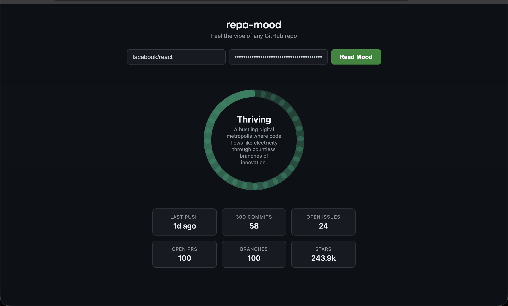

# repo-mood

> Every repo has a vibe. This one reads it.

**repo-mood** takes any public GitHub repository, pulls real activity signals, feeds them to Claude, and renders an animated SVG mood ring that captures the repo's emotional state in a single word.

Zero dependencies. One file. Pure vibes.



## The Mood Spectrum

| Mood | Ring Color | What it means |
|---|---|---|
| **Thriving** | `#1D9E75` | Humming with life — active commits, healthy PRs, engaged community |
| **Excited** | `#EF9F27` | A burst of energy — something big is happening |
| **Focused** | `#378ADD` | Head down, shipping — tight scope, steady cadence |
| **Coasting** | `#7F77DD` | Cruising on autopilot — stable but quiet |
| **Overwhelmed** | `#D85A30` | Drowning in issues and PRs — needs help |
| **Dormant** | `#888780` | Sleeping — no recent activity, but not forgotten |
| **Abandoned** | `#B4B2A9` | Gone cold — the lights are off |

## Quick Start

1. Grab an [Anthropic API key](https://console.anthropic.com/)
2. Open `index.html` in any browser
3. Type a repo (e.g. `facebook/react`, `torvalds/linux`)
4. Paste your key → **Read Mood**

That's it. No `npm install`. No build step. No server.

## What It Reads

Six signals are fetched from the GitHub REST API (public repos, no auth):

| Signal | Source |
|---|---|
| Stars & metadata | `GET /repos/{owner}/{repo}` |
| Commit velocity (30 days) | `GET /repos/{owner}/{repo}/commits` |
| Open issues | `GET /repos/{owner}/{repo}/issues` (PRs filtered out) |
| Open pull requests | `GET /repos/{owner}/{repo}/pulls` |
| Branch count | `GET /repos/{owner}/{repo}/branches` |

All signals are sent to **Claude** (`claude-sonnet-4-20250514`) which synthesizes them into a mood and a one-sentence reading.

## The Ring

- 28 arc segments with opacity gradient (35% → 100%)
- Spins gray while loading
- Settles to mood color with a slow breathing animation
- Mood word and reading displayed in the center

## Tech Stack

```
index.html  ← that's it
```

Vanilla JS. No frameworks. No bundlers. Two API calls (GitHub + Anthropic). Dark theme. Works offline once you have the signals.

## License

MIT
